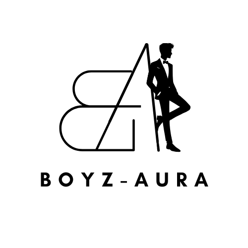

# Boyz Aura - Modern Fashion E-commerce Website

Boyz Aura is a cutting-edge e-commerce platform specializing in men's fashion and streetwear. Built with Next.js and React, this website offers a seamless shopping experience with a focus on modern design and user engagement.

## Features

- Responsive design for optimal viewing on all devices
- Dynamic product catalog with filtering and sorting capabilities
- User authentication and personalized accounts
- Shopping cart functionality with real-time updates
- Secure checkout process
- Admin dashboard for inventory and order management
- Interactive UI elements and smooth animations

## Technologies Used

- [Next.js](https://nextjs.org/) - React framework for server-side rendering and static site generation
- [React](https://reactjs.org/) - JavaScript library for building user interfaces
- [Tailwind CSS](https://tailwindcss.com/) - Utility-first CSS framework
- [Framer Motion](https://www.framer.com/motion/) - Animation library for React
- [shadcn/ui](https://ui.shadcn.com/) - Re-usable components built with Radix UI and Tailwind CSS
- [Swiper](https://swiperjs.com/) - Modern mobile touch slider
- [Lucide React](https://lucide.dev/) - Beautiful & consistent icon toolkit
